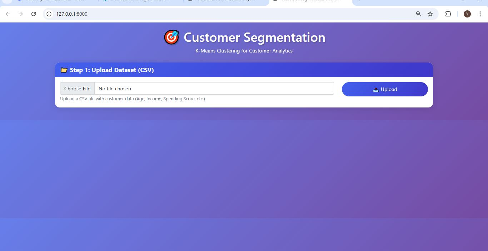
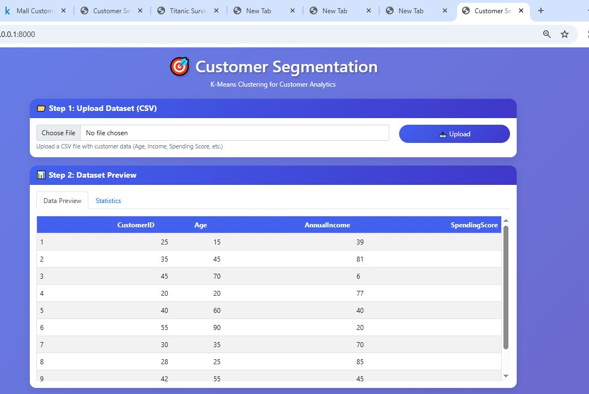
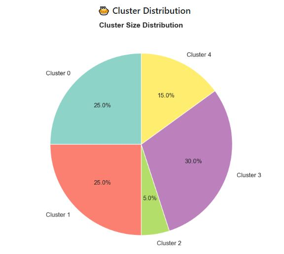
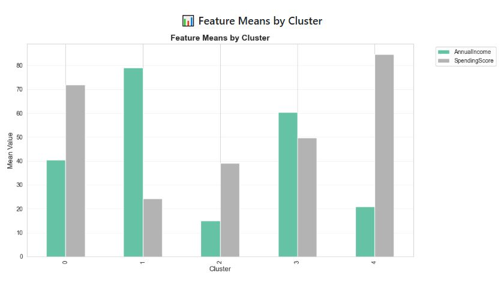
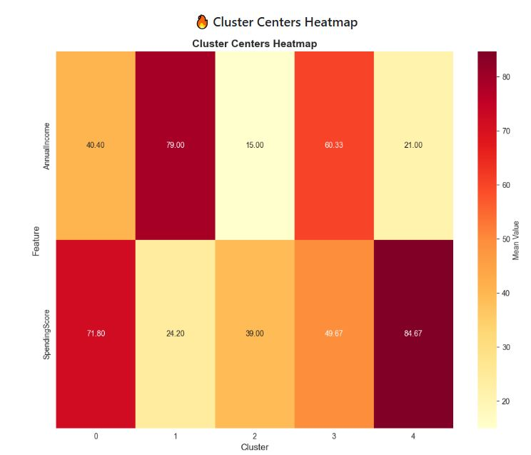
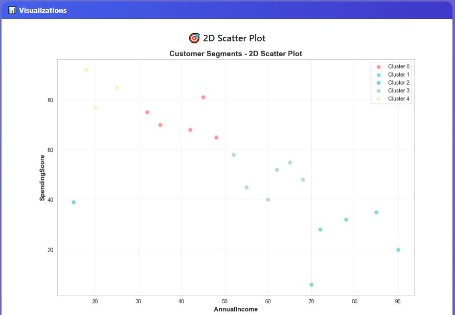
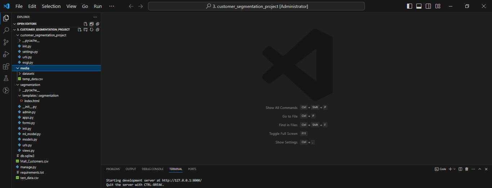

# 🎯 Customer Segmentation - K-Means Clustering Project

[](https://www.python.org/)
[](https://www.djangoproject.com/)
[](https://scikit-learn.org/)
[](LICENSE)

A complete Machine Learning web application that segments customers based on their purchasing behavior using K-Means clustering. Built with Django and deployed with a beautiful interactive interface.

---

## 📸 Project Screenshots

### 🖥️ Main GUI Interface
The main dashboard where users can upload customer data and view segmentation results.



### 🎯 Feature Selection Interface
Select features for clustering analysis.



---

## 📊 Visualizations Gallery

### 📈 Cluster Distribution Pie Chart
Visual representation of customer segment sizes showing the percentage distribution of each cluster.



### 📊 Feature Means by Cluster
Bar chart showing average feature values per cluster, helping understand segment characteristics.



### 🔥 Cluster Centers Heatmap
Heatmap visualization of cluster characteristics showing feature importance across different segments.



### 🎨 Complete Visualizations Dashboard
All visualizations displayed together for comprehensive analysis.



---

## 🏗️ Project Structure
Complete project structure for better understanding of the code organization.



---

## 📊 Project Overview

This project uses the Mall Customer Segmentation dataset to group customers into distinct segments based on their purchasing behavior using K-Means clustering algorithm. The application provides:

- **Interactive Web Interface**: Upload data and configure clustering parameters
- **Elbow Method Analysis**: Find optimal number of clusters
- **Comprehensive Visualizations**: Scatter plots, pie charts, heatmaps, and bar charts
- **Cluster Profiling**: Detailed statistics for each customer segment
- **Export Results**: Download segmented data as CSV

---

## 🎯 Features

- ✅ **Data Upload**: Support for CSV/Excel files
- ✅ **Data Preprocessing**: Handle missing values, feature scaling
- ✅ **K-Means Clustering**: Core clustering algorithm
- ✅ **Elbow Method**: Find optimal K value
- ✅ **Multiple Visualizations**:
  - 2D Scatter Plots
  - Cluster Distribution Pie Charts
  - Feature Means Bar Charts
  - Cluster Centers Heatmaps
- ✅ **Cluster Profiles**: Statistics for each segment
- ✅ **Export Results**: Download segmented data
- ✅ **Responsive Design**: Works on all devices

---

---

## 🚀 Installation & Setup

### Prerequisites

- Python 3.9 or higher
- pip package manager

### Step-by-Step Installation

1. **Download the Project**
   - Download [3. customer_segmentation_project.rar](3.%20customer_segmentation_project.rar)
   - Extract the files to your desired location

2. **Create a virtual environment**
```bash
# Windows
python -m venv venv
venv\Scripts\activate

# Linux/Mac
python3 -m venv venv
source venv/bin/activate
